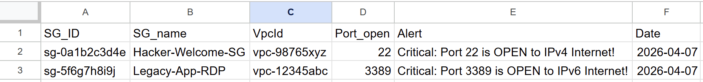
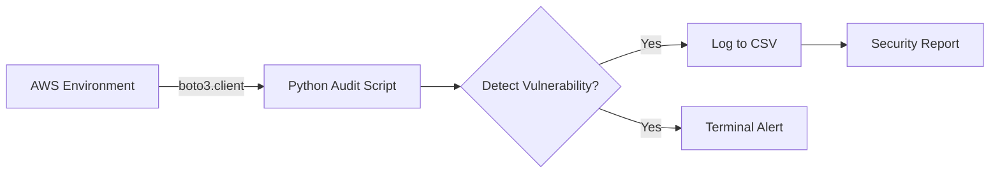

# AWS Security Group Auto-Auditor 🛡️

An automated Python/Boto3 utility designed to scan AWS environments, detect critical security vulnerabilities in EC2 Security Groups (such as publicly exposed SSH/RDP ports), and generate comprehensive CSV reports for compliance auditing.

## 🎯 The Problem It Solves
Misconfigured Security Groups are the #1 cause of AWS cloud breaches. In large environments with hundreds of Security Groups, manually checking for open ports is time-consuming and error-prone. This tool automates the audit process, catching both IPv4 and IPv6 misconfigurations in seconds.

## ✨ Key Features
* **Deep Inspection:** Scans all Security Groups in a specified AWS Region.
* **Dual-Stack Detection:** Identifies port 22 (SSH) and 3389 (RDP) exposures across both **IPv4 (`0.0.0.0/0`)** and **IPv6 (`::/0`)** ranges.
* **Idempotent Reporting:** Automatically creates or appends to a `sg_report.csv` file without duplicating headers.
* **Local Testing Ready:** Fully compatible with LocalStack for offline testing and CI/CD pipeline integration.

## 🚀 Quick Start

### Prerequisites
* Python 3.x installed
* `boto3` library (`pip install boto3`)
* AWS CLI configured with appropriate credentials (`aws configure`)
    *(Note: If using LocalStack, standard AWS credentials are not required).*

### Execution
1. Clone the repository:
   ```bash
   git clone [https://github.com/your-username/aws-security-auditor.git](https://github.com/your-username/aws-security-auditor.git)
   cd aws-security-auditor

2. Run the script
    python scripts/aws_sg_audit.py



🏗️ Technical Architecture
This script utilizes boto3.client('ec2') for high-performance API calls. It parses nested JSON responses, iterating through IpPermissions, IpRanges, and Ipv6Ranges to extract precise routing data. The use of the OS module ensures clean data appending for daily cron-job executions.

Developed for robust Cloud FinOps and NetDevOps automation.


